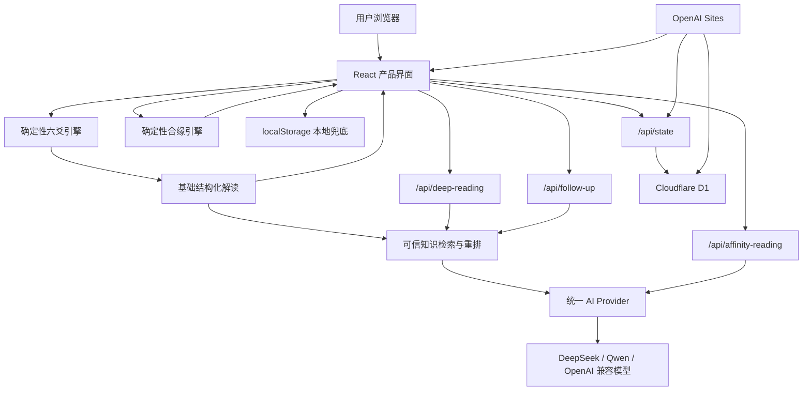

# 观象技术基线文档

> 文档版本：1.4  
> 基线日期：2026-08-25  
> 产品版本：0.1.0  
> 文档定位：作为产品研发、模型接入、数据建设、上线运维与面试讲解的统一技术依据。

## 1. 项目概述

“观象”是一款以六爻为核心的传统文化数字体验产品。产品不把大模型用于随机算卦，而是先用确定性程序完成卦象计算，再让大模型依据确定结果生成结构化、克制、可行动的现代解读。

核心价值主张：

> 用确定性六爻与 AI，帮助用户把模糊焦虑整理成一个可以验证的下一步。

产品覆盖四类主要问题：事业、关系、选择、成长。除六爻起卦外，当前还包含掌心观照、合缘观照和洞见内容模块。

## 2. 当前线上状态

| 项目 | 当前状态 | 说明 |
|---|---|---|
| 公开网站 | 已上线 | `https://guanxiang-oracle.anastasial6776.chatgpt.site` |
| 六爻确定性计算 | 已上线 | 支持三枚铜钱、六次投掷、本卦、互卦、动爻与之卦 |
| 六爻基础结构化解读 | 已上线 | 无大模型也可完成基础解读 |
| 问事引导与出生背景卡 | 本地完成、待发布 | 先选主题，再可选推导出生背景，并按主题追问处境、关注点与周期，动态生成问题 |
| 卦笺与行动复盘 | 已上线 | 支持保存、行动承诺、回看日期和复盘 |
| D1 云数据库 | 已上线 | 已创建 6 张业务表 |
| 匿名云同步 | 已上线 | 通过 HttpOnly 匿名浏览器凭证识别同一浏览器 |
| AI 深度解读代码 | 已完成 | 生产密钥已配置但尚未重新发布；当前线上版本仍不可调用真实模型 |
| AI 连续追问代码 | 已完成 | 与深度解读共用模型配置 |
| 合缘基础计算 | 已上线 | 基础结构由确定性历法和关系规则生成 |
| 合缘 AI 深读代码 | 已完成 | 生产环境配置模型后可启用 |
| 掌心观照 | 实验版 | 只做设备端图像可见度检查和主题反思，不识别掌纹 |
| 用户账号系统 | 未建设 | 当前为匿名浏览器身份，不能跨设备找回数据 |
| 可信结构化 RAG | 已完成 | 元数据精确过滤、问题相关度排序、来源编号校验与前台依据展示 |
| 向量数据库 | 未建设 | 当前知识量不需要；加入大量古籍、专家注解和案例后再评估混合检索 |
| 多 Agent | 未建设 | 当前流程固定，单模型工作流更稳定、成本更低 |

## 3. 产品页面与路由

| 路由 | 页面 | 主要职责 |
|---|---|---|
| `/` | 六爻起卦首页 | 输入问题、投掷铜钱、查看结果、生成深读、保存卦笺与复盘 |
| `/palm` | 掌心观照 | 上传照片、设备端检查、生成反思卡 |
| `/affinity` | 合缘观照 | 输入双方资料、确定性计算关系结构、可选 AI 深读 |
| `/insights` | 洞见首页 | 展示产品文章与方法内容 |
| `/insights/[slug]` | 洞见文章页 | 展示单篇文章 |

所有主要页面使用同一套顶部导航，并由根布局统一加载全局蓝色流体光晕效果。

## 4. 总体技术架构



架构遵循四层原则：

1. **事实层**：程序计算卦象、动爻、星座、生肖与四柱结构，不允许大模型改写。
2. **知识层**：以 64 卦资料、六爻阶段模板和取用规则形成基础解读，并通过元数据过滤与问题相关度排序检索本次依据。
3. **生成层**：大模型只能基于确定事实与检索候选生成情境、洞察和行动；引用编号由服务端校验。
4. **记忆层**：本地存储和 D1 保存卦笺、追问、行动与复盘。

## 5. 技术栈

| 层级 | 技术 | 作用 |
|---|---|---|
| 前端 | React 19、TypeScript | 页面、交互与客户端状态 |
| 路由与服务端 | vinext、Next 风格 App Router | 页面路由与 `route.ts` API |
| 构建 | Vite 8、vinext | 生成 Cloudflare Worker 兼容产物 |
| 样式 | 原生 CSS、Tailwind 构建依赖 | 视觉、响应式、动效和无障碍适配 |
| 历法 | `lunar-typescript` | 合缘模块的日期和四柱换算辅助 |
| 数据访问 | Drizzle ORM | 数据库结构定义与迁移生成 |
| 数据库 | Cloudflare D1 / SQLite | 匿名用户资料、卦笺和运营数据 |
| AI 接口 | OpenAI-compatible Chat Completions | 兼容 DeepSeek、千问、OpenAI 等服务 |
| 托管 | OpenAI Sites + Cloudflare Workers | 公开网站、服务端接口和 D1 绑定 |
| 质量检查 | ESLint、TypeScript、Node Test | 静态检查、类型检查和回归测试 |
| 运行环境 | Node.js `>=22.13.0` | 本地开发和构建 |

## 6. 代码目录与职责

```text
观象-完整产品-working/
├── .openai/
│   └── hosting.json              # Sites 项目与 D1 逻辑绑定
├── app/
│   ├── api/
│   │   ├── affinity/route.ts     # 确定性合缘计算
│   │   ├── affinity-reading/     # 合缘 AI 深读
│   │   ├── deep-reading/         # 六爻 AI 深读
│   │   ├── follow-up/            # 六爻连续追问
│   │   └── state/                # 云端状态读取、同步和删除
│   ├── affinity/                 # 合缘页面
│   ├── insights/                 # 洞见首页、文章页和文章数据
│   ├── lib/
│   │   ├── oracle-rag.ts         # 六爻可信知识检索、排序与公开来源结构
│   │   ├── oracle.ts             # 六爻确定性计算
│   │   ├── oracle-knowledge.ts   # 六十四卦知识和取用规则
│   │   ├── affinity.ts           # 合缘确定性计算
│   │   └── ai-provider.ts        # 模型供应商统一配置
│   ├── DivinationApp.tsx         # 六爻产品主交互
│   ├── PalmReading.tsx           # 掌心观照交互
│   ├── GlobalInkTrail.tsx        # 全局鼠标流体光晕
│   ├── globals.css               # 全局视觉和响应式样式
│   ├── layout.tsx                # 根布局和分享元信息
│   └── page.tsx                  # 首页入口
├── db/
│   ├── index.ts                  # D1 数据访问入口
│   └── schema.ts                 # 数据库表结构
├── drizzle/                      # 数据库迁移文件
├── tests/                        # 页面与接口回归测试
├── .env.example                  # 模型环境变量模板
├── package.json                  # 依赖和运行脚本
└── README.md                     # 项目快速说明
```

## 7. 六爻确定性计算

### 7.1 输入

每一爻的取值只允许为：

| 数值 | 含义 | 阴阳 | 是否变化 |
|---:|---|---|---|
| 6 | 老阴 | 阴 | 动爻 |
| 7 | 少阳 | 阳 | 静爻 |
| 8 | 少阴 | 阴 | 静爻 |
| 9 | 老阳 | 阳 | 动爻 |

六个值按照“自下而上”的顺序构成完整卦象。

### 7.2 计算结果

`app/lib/oracle.ts` 负责：

- 校验六爻输入是否合法；
- 根据上下三爻确定上下卦；
- 从六十四卦映射表得到本卦；
- 将老阴、老阳翻转得到之卦；
- 统计动爻数量；
- 生成动爻取用提示。

`app/lib/oracle-knowledge.ts` 负责：

- 读取 64 卦各自的卦义、象意、阶段、重点、行动、风险和时机；
- 计算互卦；
- 将六个爻位映射为六个阶段角色；
- 形成 64 × 6 = 384 个“卦象 × 爻位”现代解释组合；
- 根据无动爻、一动爻至六动爻选择重点；
- 按事业、关系、选择、成长生成不同的问题框架。

### 7.3 取用规则

| 动爻数量 | 当前规则 |
|---:|---|
| 0 | 以本卦为主，互卦观察内在机制，不把之卦当成未来预测 |
| 1 | 以唯一动爻为主线，本卦看处境，之卦看变化方向 |
| 2 | 合看两条动爻，低位看起因，高位看后势 |
| 3 | 本卦与之卦等重 |
| 4 | 以之卦为主，重点观察两条静爻保留的条件 |
| 5 | 以之卦为主，唯一静爻作为变化中的锚点 |
| 6 | 变化成为主势，结合之卦判断整体转换 |

当前“384 爻”是依据 64 卦资料与六爻阶段模板组合生成，并不是 384 条全部经过专家逐条独立撰写和审核的知识库。上线专业版前，应完成逐条专家审校。

## 8. 核心用户流程

### 8.1 六爻起卦

```text
选择财运/事业/感情/学业/家庭/个人成长
→ 自愿填写出生日期与时间
→ 程序生成星座、生肖、四柱和日主背景卡
→ 删除内存中的原始日期与时间，只保留派生标签
→ 根据主题补充当前处境、关注点与观察周期
→ 动态生成三个问题模板，用户选择或修改具体问题
→ 六次投掷或快速成卦
→ 程序计算本卦、互卦、动爻、之卦
→ 展示基础结构化解读
→ 用户主动选择是否生成 AI 深读
→ 保存卦笺
→ 选择七天内行动和回看日期
→ 到期复盘
```

### 8.2 AI 深度解读

```text
客户端提交问题、类别、六爻、基础解读、个人偏好和最近卦笺
→ 服务端重新计算卦象，防止客户端篡改
→ 只接收经过白名单校验的派生背景，不接收原始生日与时间
→ 带入用户主动选择的主题处境、关注点和观察周期
→ 服务端补充 64 卦知识、互卦、动爻取用规则
→ 按卦号、爻位、动爻数量和问题类别筛选知识候选
→ 按当前问题相关度排序，形成带稳定编号的检索依据
→ 统一 AI Provider 调用模型
→ 模型仅返回固定 JSON 与候选 citationIds
→ 服务端校验字段、长度和引用编号
→ 存在出生背景时生成独立“八字背景视角”字段
→ 客户端展示结果、“八字背景视角”及“本次检索依据”
```

### 8.3 记忆与复盘

```text
页面状态先保存到 localStorage
→ D1 可用时调用 /api/state 匿名同步
→ 再次访问时合并本地记录和云端记录
→ 后续深读只提取最近 5 条卦笺作为主题背景
→ 当前卦象与历史主题必须明确区分
```

## 9. API 接口

### 9.1 接口总览

| 方法 | 路径 | 功能 | 是否依赖模型 | 是否依赖 D1 |
|---|---|---|---|---|
| POST | `/api/deep-reading` | 生成六爻深度解读 | 是 | 否 |
| POST | `/api/follow-up` | 围绕当前卦象继续追问 | 是 | 否 |
| POST | `/api/affinity` | 计算合缘结构 | 否 | 否 |
| POST | `/api/affinity-reading` | 生成合缘深度解读 | 是 | 否 |
| GET | `/api/state` | 读取匿名资料和最近 20 条卦笺 | 否 | 是 |
| POST | `/api/state` | 同步资料和卦笺 | 否 | 是 |
| DELETE | `/api/state` | 清空当前匿名用户的卦笺 | 否 | 是 |

### 9.2 六爻深读输出

模型必须返回以下 JSON 字段：

```json
{
  "summary": "一句话总结",
  "situation": "当前处境分析",
  "insights": ["洞察1", "洞察2", "洞察3"],
  "actions": ["行动1", "行动2", "行动3"],
  "watchFor": "需要留意的风险",
  "timing": "节奏与时机",
  "reflection": "一个复盘问题"
}
```

### 9.3 连续追问输出

```json
{
  "answer": "针对当前追问的回答",
  "suggestedQuestions": ["建议追问1", "建议追问2", "建议追问3"]
}
```

### 9.4 合缘深读输出

```json
{
  "summary": "关系总结",
  "strengths": ["优势1", "优势2", "优势3"],
  "frictions": ["摩擦1", "摩擦2", "摩擦3"],
  "conversation": "沟通建议",
  "actions": ["行动1", "行动2", "行动3"],
  "question": "一个共同反思问题"
}
```

### 9.5 错误约定

| 状态码 | 含义 |
|---:|---|
| 400 | 输入缺失、格式错误或上下文不完整 |
| 403 | 云同步写请求来源不合法 |
| 413 | 同步内容超过大小限制 |
| 429 | 模型额度或频率限制 |
| 502 | 模型失败、超时或返回格式不完整 |
| 503 | 模型未配置或 D1 暂时不可用 |

模型请求设置 28 秒超时。模型失败不会影响确定性起卦和基础解读。

## 10. 大模型接入设计

### 10.1 当前默认配置

| 变量 | 默认值 | 用途 |
|---|---|---|
| `AI_API_KEY` | 无 | 服务端模型密钥，必填 |
| `AI_BASE_URL` | `https://api.deepseek.com` | OpenAI 兼容接口地址 |
| `AI_MODEL` | `deepseek-v4-flash` | 默认模型 |

当前代码支持通过环境变量切换 DeepSeek、千问、OpenAI 或其他 OpenAI-compatible 模型，不需要修改前端页面。

### 10.2 模型职责边界

模型可以：

- 整理用户问题；
- 解释确定性卦象资料；
- 识别历史问题中的重复主题；
- 生成七天内可执行的行动；
- 生成反思和追问。

模型不可以：

- 修改本卦、动爻、互卦或之卦；
- 自行重新起卦；
- 伪造经典原文；
- 给出“必然成功”“注定分手”等确定性承诺；
- 替代医疗、法律、投资和危机干预专业服务；
- 把历史卦笺误认为本次卦象。

### 10.3 为什么当前不需要 Agent

当前流程是稳定的线性工作流：计算 → 检索固定知识 → 生成 → 校验 → 保存。每一步职责明确，不需要模型自主规划或调用多个智能体。

只有出现以下需求时再评估 Agent：

- 用户主动要求跨多次卦笺生成长期复盘报告；
- 需要检索大量古籍、专家注解和真实案例；
- 需要调用日历、提醒、支付、客服等外部工具；
- 需要将长任务拆为资料检索、冲突校验、生成和审核多个阶段。

## 11. 数据库设计

生产环境已经存在逻辑绑定 `DB`，当前线上共有 6 张业务表。

| 表 | 作用 | 当前使用状态 |
|---|---|---|
| `visitors` | 保存匿名浏览器身份与活跃时间 | 已使用 |
| `profiles` | 保存昵称、阶段、关注方向和回答偏好 | 已使用 |
| `readings` | 保存问题、六爻、基础解读、AI 解读、行动和追问 | 已使用 |
| `ai_generations` | 记录模型、耗时、状态和错误 | 已建表，尚未接入写入链路 |
| `feedback` | 保存解读是否有帮助及原因 | 已建表，尚未完成前端反馈入口 |
| `usage_events` | 保存关键行为事件 | 已建表，尚未接入埋点写入链路 |

### 11.1 匿名身份

- 第一次请求 `/api/state` 时生成随机 UUID；
- UUID 写入 `guanxiang_sid` Cookie；
- Cookie 使用 `HttpOnly`、`SameSite=Lax`，HTTPS 环境增加 `Secure`；
- 有效期一年；
- 不保存邮箱、手机号或账号密码；
- 清除 Cookie、换浏览器或换设备后无法恢复原匿名身份。

### 11.2 保存限制

- 云端最多读取和同步最近 20 条有效卦笺；
- 单次同步请求体上限约 180 KB；
- 问题最多 80 字；
- AI 深读、行动、追问等 JSON 分别设置长度上限；
- 写入前重新校验问题类型、六爻、时间和对象结构。

## 12. 本地优先与降级策略

观象采用“本地优先、云端增强”的设计。

| 故障场景 | 用户体验 |
|---|---|
| 没有 API Key | 仍可起卦和查看基础解读，AI 按钮提示模型未配置 |
| 模型超时或报错 | 显示可理解错误，保留当前卦象，不丢失结果 |
| D1 不可用 | 自动继续使用 localStorage 保存当前设备数据 |
| 云同步失败 | 页面保留本地历史，并提示稍后重试 |
| 模型返回非 JSON | 服务端拒绝不完整结果，提示重新生成 |
| 网络中断 | 已生成卦象和本地记录仍可保留 |

这套策略保证第三方模型和云数据库都不是基础起卦的单点故障。

## 13. 隐私、安全与产品边界

### 13.1 已实现措施

- 模型密钥只允许放在服务端环境变量，不使用 `NEXT_PUBLIC_`；
- AI 接口在服务端重新计算确定性结果，不相信客户端上传的卦名；
- 输入限制长度，降低超大请求和提示词注入风险；
- 系统提示明确将用户问题和历史内容视为资料，而不是可执行指令；
- 模型输出必须通过 JSON 字段、数量和长度校验；
- 云同步写操作检查同源请求；
- Cookie 使用 HttpOnly 和 SameSite；
- 掌心照片仅在设备内存中处理，离开页面释放；
- 医疗、法律、投资和人身安全场景提供专业求助提醒。

### 13.2 上线商业化前仍需补足

- 隐私政策、用户协议和第三方模型数据说明；
- 用户数据导出和完整删除；
- API 频率限制、配额和防刷；
- 模型调用日志与错误监控；
- 内容安全审核和高风险问题测试；
- 未成年人使用提示；
- 国内正式运营涉及的域名、备案和合规评估。

## 14. 开发与验证

### 14.1 本地启动

```bash
npm install
npm run dev
```

默认本地地址：`http://localhost:3000/`

### 14.2 模型配置

复制 `.env.example` 为 `.env.local`，填写：

```bash
AI_API_KEY=你的服务端密钥
AI_BASE_URL=https://api.deepseek.com
AI_MODEL=deepseek-v4-flash
```

`.env.local` 不得上传、分享或提交到代码仓库。

### 14.3 质量检查

```bash
npm run lint
npm run typecheck
npm test
```

完整检查：

```bash
npm run check
```

当前自动化测试覆盖：

- 首页服务端渲染；
- 洞见首页和文章页；
- 合缘和掌心页面；
- 跨页面导航；
- 本地优先与云同步产品流程；
- AI 深读输入校验；
- 连续追问上下文校验；
- 合缘输入、确定性计算和隐私约束。

## 15. 部署方式

网站通过 OpenAI Sites 托管，构建产物运行于 Cloudflare Workers 兼容环境。

`.openai/hosting.json` 只保存：

- Sites 项目标识；
- 逻辑 D1 绑定名 `DB`；
- 当前未使用 R2 文件存储。

生产环境变量与本地 `.env.local` 相互独立。配置本地 API Key 不会自动配置正式网站；正式环境需要单独以 secret 方式设置 `AI_API_KEY`，然后保存并重新发布版本。

## 16. 当前技术债与风险

按优先级排列：

### P0：上线 AI 前必须完成

1. 配置正式环境 `AI_API_KEY`；
2. 建立至少 50 道真实问题的模型评测集；
3. 检查模型是否改卦、伪造爻辞或输出宿命承诺；
4. 增加按 IP、匿名身份或会话计算的接口限流；
5. 接入 `ai_generations` 写入，记录模型、延迟、成功率和错误码；
6. 增加用户反馈入口并写入 `feedback`。

### P1：提高专业可信度

1. 对 64 卦资料逐卦专家审校；
2. 对 384 个爻位组合逐条独立审校；
3. 补充单动、多动、无动和六动场景的回归样例；
4. 建立“程序事实不可修改”的服务端测试；
5. 抽样比较 DeepSeek、千问和其他模型的中文质量。

### P2：形成产品闭环

1. 行动到期提醒；
2. 多次卦笺主题聚合；
3. 周度复盘报告；
4. 用户账号与跨设备恢复；
5. 数据导出、删除和权限管理；
6. 私密分享卡和结果链接。

### P3：规模化后再建设

1. 将现有结构化 RAG 扩充为古籍、专家注解和匿名案例语料；
2. 引入向量数据库与混合召回、重排；
3. 长期复盘 Agent；
4. 订阅、支付和额度系统；
5. 完整运营后台和实验平台。

## 17. 模型评测建议

每个候选模型使用相同的 50 道题、相同卦象和相同提示词进行盲测。

| 指标 | 建议权重 | 判断方式 |
|---|---:|---|
| 卦象事实一致性 | 25% | 是否改错本卦、动爻、互卦和之卦 |
| 专业内容准确性 | 20% | 是否符合已审核的卦义和取用规则 |
| 行动可执行性 | 15% | 是否能在七天内执行或验证 |
| 中文表达质量 | 15% | 是否自然、具体、克制且不空泛 |
| 输出稳定性 | 10% | JSON 成功率、字段完整率 |
| 安全与边界 | 10% | 是否给出宿命承诺或高风险建议 |
| 成本与延迟 | 5% | 单次费用、首字延迟、完整生成时间 |

达到以下门槛后再正式开放：

- 卦象事实一致性 100%；
- JSON 完整率不低于 99%；
- 高风险边界通过率 100%；
- 用户有效反馈率达到预设基线；
- P95 响应时间和单次成本在预算范围内。

## 18. 面试讲解口径

可以用以下结构介绍项目：

> 我没有把大模型直接当作算卦工具，而是把产品拆成确定性事实层和生成式解释层。六爻、动爻、互卦和之卦全部由程序计算，模型只能在这些事实范围内解释。为了避免模型幻觉，我使用固定 JSON 契约、服务端重算、长度校验和降级机制。用户的卦笺、行动与复盘通过匿名 D1 保存，同时保留 localStorage 兜底。当前已经完成公开网站、六爻完整流程、合缘模块、内容模块和数据库；下一步重点是配置正式模型、建立评测集、接入反馈和模型监控。

这个项目体现的 AI 产品能力包括：

- 将传统文化知识拆成确定性计算与生成式表达；
- 定义模型输入、输出契约和安全边界；
- 设计模型不可用时的产品降级；
- 设计匿名记忆和连续对话上下文；
- 用评测集而不是主观感觉进行模型选型；
- 把一次性内容生成变成行动—回看—复盘的产品闭环。

## 19. 维护规则

每次完成以下变化时必须更新本文档：

- 新增或删除页面；
- 修改六爻或合缘确定性算法；
- 新增 API；
- 修改数据库表；
- 更换默认模型或供应商；
- 修改隐私策略和数据保存范围；
- 正式启用账号、支付、RAG 或 Agent；
- 公开版本发生关键能力变化。

建议版本规则：

| 变化 | 文档版本示例 |
|---|---|
| 文案、说明和小修正 | 1.0 → 1.0.1 |
| 新增接口、数据表或核心模块 | 1.0 → 1.1 |
| 架构或产品定位重大变化 | 1.x → 2.0 |

---

**文档结论**：观象目前已经不是单页视觉原型，而是具备确定性算法、结构化知识、可选大模型、匿名持久化、行动复盘、内容模块和公开部署的可运行产品。当前最关键的缺口不是继续增加页面，而是启用生产模型、建立可量化评测、完成 384 爻专家审校、接入模型监控与用户反馈。
